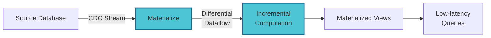

# Materialize
## The Power of Incremental View Maintenance

Deliver **1000x performance** for read-heavy workloads with fresh data

<div class="mt-12 py-1" @click="$slidev.nav.next" hover:bg="white op-10">
  Press Space for next page <carbon:arrow-right />
</div>

<div class="abs-br m-6 text-xl">
  <a href="https://materialize.com" target="_blank" class="slidev-icon-btn">
    <carbon:link />
  </a>
</div>

---

# The Database Read Performance Challenge

Traditional approaches face a fundamental trade-off

<div class="grid grid-cols-2 gap-8 mt-8">
  <div>
    <h3 class="text-green-400 mb-4">What We Want</h3>
    <ul>
      <li>✓ Low query latency</li>
      <li>✓ Fresh, real-time data</li>
      <li>✓ Minimal core DB impact</li>
      <li>✓ Reasonable infrastructure costs</li>
    </ul>
  </div>
  <div>
    <h3 class="text-red-400 mb-4">What We Get</h3>
    <ul>
      <li>✗ Choose 2 out of 3:</li>
      <li class="ml-4">- Low latency</li>
      <li class="ml-4">- Fresh data</li>
      <li class="ml-4">- Low DB impact</li>
    </ul>
  </div>
</div>

---

# Traditional Approaches: The Trade-offs

Each solution sacrifices something critical

<div class="mt-8">

| Method | Latency | Data Freshness | Core DB Impact | Cost |
|--------|---------|----------------|----------------|------|
| **Direct Queries** | 🔴 HIGH | 🟢 FRESH | 🔴 HIGH | 💸 |
| **Materialized Views** | 🟢 LOW | 🔴 STALE | 🟡 MEDIUM | 💸💸 |
| **Read Replicas** | 🔴 HIGH | 🟢 FRESH | 🟢 LOW | 💸💸💸 |
| **Data Warehouse** | 🟢 LOW | 🔴 STALE | 🟢 LOW | 💸💸💸💸 |

</div>

<div v-click class="mt-8 text-center text-xl">
  <span class="text-yellow-400">What if we could have it all?</span>
</div>

---
layout: center
---

# Enter: Incremental View Maintenance Replicas (IVMRs)

<div class="text-2xl mt-8">
  <span class="text-green-400">LOW</span> Latency + 
  <span class="text-green-400">FRESH</span> Data + 
  <span class="text-green-400">LOW</span> DB Impact
</div>

---

# How IVMRs Work

Powered by Differential Dataflow technology

<div class="mt-8">



</div>

<div class="mt-8">

Key Innovation: **"Determine, as updates come in, the exact amount of new work that needs to be done"**

- No full recomputation
- Updates propagate incrementally
- Maintains consistency automatically
- Scales with change rate, not data size

</div>

---

# What Makes IVMRs Special?

Index SQL views with complex operations

<div class="grid grid-cols-2 gap-8 mt-8">
  <div>
    <h3 class="text-blue-400 mb-4">Supported Operations</h3>
    <ul>
      <li>✓ Complex JOINs</li>
      <li>✓ Aggregations (GROUP BY)</li>
      <li>✓ Window functions</li>
      <li>✓ Recursive queries</li>
      <li>✓ Subqueries</li>
    </ul>
  </div>
  <div>
    <h3 class="text-purple-400 mb-4">Real-time Updates</h3>
    <ul>
      <li>✓ Millisecond latency</li>
      <li>✓ Consistent snapshots</li>
      <li>✓ No eventual consistency</li>
      <li>✓ ACID guarantees</li>
    </ul>
  </div>
</div>

---
layout: image-right
image: https://images.unsplash.com/photo-1551288049-bebda4e38f71?q=80&w=2940&auto=format&fit=crop
---

# Real-World Use Cases

Where IVMRs shine

<div class="text-sm">

**Operational Dashboards**  
Real-time metrics without impacting production

**Fraud Detection**  
Instant pattern matching on transaction streams

**Supply Chain Monitoring**  
Track inventory and shipments in real-time

**Business Intelligence**  
Fresh analytics without the data warehouse lag

**Customer 360 Views**  
Unified, always-current customer profiles

</div>

---

# Performance Impact: Real Numbers

The difference is dramatic

<div class="mt-8 text-center">

## Query Latency Comparison

<div class="grid grid-cols-3 gap-8 mt-8">
  <div class="border-2 border-gray-600 rounded p-6">
    <h3 class="text-red-400">Traditional Query</h3>
    <div class="text-4xl mt-4">2-5s</div>
    <div class="text-sm mt-2">Complex JOIN + GROUP BY</div>
  </div>
  <div class="border-2 border-gray-600 rounded p-6">
    <h3 class="text-yellow-400">Read Replica</h3>
    <div class="text-4xl mt-4">1-3s</div>
    <div class="text-sm mt-2">Still computing on read</div>
  </div>
  <div class="border-2 border-green-400 rounded p-6">
    <h3 class="text-green-400">IVMR</h3>
    <div class="text-4xl mt-4">2-5ms</div>
    <div class="text-sm mt-2">Pre-computed, fresh</div>
  </div>
</div>

<div v-click class="mt-8 text-2xl">
  That's a <span class="text-green-400">1000x improvement</span>!
</div>

</div>

---

# Success Story: Datalot

90% cost reduction with better performance

<div class="mt-8">

### The Challenge
- Real-time fraud detection system
- Processing millions of transactions
- Complex pattern matching queries
- High infrastructure costs

### The Solution with IVMRs
- Replaced multiple read replicas
- Maintained sub-second query response
- **90% reduction in infrastructure costs**
- Improved fraud detection accuracy

</div>

<div v-click class="mt-6 p-4 bg-green-900 bg-opacity-20 rounded">
  💡 **Key Insight**: "IVMRs allowed us to run complex analytical queries in production without fear"
</div>

---

# Technical Deep Dive

Understanding the magic behind IVMRs

<div class="mt-6">

```sql
-- Traditional approach: Recompute everything
CREATE MATERIALIZED VIEW sales_by_region AS
SELECT 
    region,
    product_category,
    SUM(amount) as total_sales,
    COUNT(*) as transaction_count
FROM sales s
JOIN products p ON s.product_id = p.id
JOIN stores st ON s.store_id = st.id
GROUP BY region, product_category;

-- With IVMR: Only compute the delta
-- When a new sale arrives:
-- 1. Identify affected region & category
-- 2. Update only that cell in the result
-- 3. No full table scan needed!
```

</div>

---
layout: two-cols
---

# Setting Up IVMRs

Simple integration process

<div class="mt-4">

### 1. Connect to Source
```sql
CREATE SOURCE postgres_source
FROM POSTGRES CONNECTION 'host=...'
PUBLICATION 'mz_source';
```

### 2. Create Views
```sql
CREATE MATERIALIZED VIEW my_view AS
SELECT ... FROM source_table
JOIN ... GROUP BY ...;
```

### 3. Query Away
```sql
SELECT * FROM my_view
WHERE condition = 'value';
-- Returns in milliseconds!
```

</div>

::right::

<div class="mt-12 ml-8">

### Benefits Realized

✅ **Immediate Performance**
No warming period needed

✅ **Zero Application Changes**
Standard SQL interface

✅ **Automatic Optimization**
Materialize handles the complexity

✅ **Scale on Demand**
Add replicas as needed

</div>

---

# IVMRs vs Traditional Solutions

The clear winner for read-heavy workloads

<div class="mt-8">

| Capability | IVMRs | Read Replicas | Caching | Data Warehouse |
|------------|-------|---------------|---------|----------------|
| **Query Latency** | ms | seconds | ms* | seconds |
| **Data Freshness** | Real-time | Real-time | Stale | Hours/Days |
| **Complex Queries** | ✅ | ✅ | ❌ | ✅ |
| **Maintenance** | Automatic | Manual | Manual | Manual |
| **Cost at Scale** | Low | High | Medium | Very High |

<div class="text-sm mt-4">
*Caching provides low latency only for exact query matches
</div>

</div>

---
layout: center
---

# When to Use IVMRs

<div class="text-xl mt-8">

Perfect for workloads that need:

<div class="grid grid-cols-2 gap-8 mt-8">
  <div class="text-left">
    ✅ Sub-second query response<br/>
    ✅ Complex aggregations/joins<br/>
    ✅ Real-time data freshness<br/>
  </div>
  <div class="text-left">
    ✅ Predictable performance<br/>
    ✅ Cost-effective scaling<br/>
    ✅ Minimal operational overhead<br/>
  </div>
</div>

</div>

---
layout: image
image: https://images.unsplash.com/photo-1451187580459-43490279c0fa?q=80&w=2944&auto=format&fit=crop
class: text-center
---

# Ready to Transform Your Read Performance?

<div class="mt-32">

## Get Started with Materialize IVMRs

<div class="mt-8 text-xl">
  <a href="https://materialize.com" class="text-blue-400 hover:text-blue-300">
    materialize.com
  </a>
</div>

<div class="mt-4">
  Experience 1000x performance improvement today
</div>

</div>

---
layout: center
class: text-center
---

# Key Takeaways

<div class="mt-8 text-left max-w-2xl mx-auto">

1. **IVMRs deliver the impossible**: Low latency + Fresh data + Low DB impact

2. **1000x performance improvement** for complex read queries

3. **90% cost reduction** possible vs traditional architectures

4. **Zero application changes** required - just point and query

5. **Perfect for**: Dashboards, analytics, fraud detection, real-time monitoring

</div>

<div class="mt-12">
  <a href="https://materialize.com/blog/ivm-database-replica/" class="text-blue-400">
    Read the full blog post →
  </a>
</div>